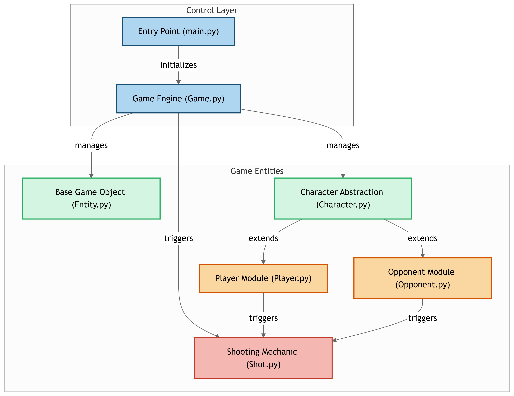

# Tarea1_24_25

Este es mi primer repositorio en GitHub. Aquí se encuentra la tarea 1 de la materia de Lenguajes de Programación 2, correspondiente a los temas 24 y 25.

Este es mi link del repositorio:

https://github.com/rubences/Tarea1_24_25.git


# Desarrollo de un Juego de Disparos en Python utilizando Programación Orientada a Objetos (POO)

Este proyecto implementa un juego de disparos clásico utilizando Python, aplicando los principios de programación orientada a objetos (POO). El jugador controla un personaje principal que debe disparar a los enemigos, esquivar sus disparos y enfrentarse a un jefe final. El objetivo es convertir a los enemigos en estrellas, acumular puntos y ganar el juego.

## Estructura del Proyecto

El proyecto está organizado en varias clases que representan los elementos principales del juego. Además, se incluye un diagrama de clases para visualizar la relación entre las clases en el archivo `diagram.png`.

### Clases Principales

1. **Entity**: Clase base que representa cualquier elemento del juego.
   - **Atributos**: `x`, `y`, `image`
   - **Métodos**: `move()`, `draw()`, `update()`, `reset()`, `serialize()`, `deserialize()`

2. **Character** (hereda de `Entity`): Representa cualquier personaje con vida.
   - **Atributos**: `lives`, `is_alive`
   - **Métodos**: `move()`, `shoot()`, `collide()`, `reset()`

3. **Player** (hereda de `Character`): Representa al jugador principal.
   - **Atributos**: `score`, `lives` (inicialmente 3)
   - **Métodos**: `move()`, `shoot()`, `collide()`, `respawn()`, `reset()`

4. **Opponent** (hereda de `Character`): Representa a los enemigos.
   - **Atributos**: `is_star` (indica si ha sido convertido en estrella)
   - **Métodos**: `move()`, `shoot()`, `collide()`, `reset()`

5. **Boss** (hereda de `Opponent`): Representa al jefe final.
   - **Métodos**: `special_attack()`, `move()`, `take_damage()`, `defeated()`

6. **Shot** (hereda de `Entity`): Representa los disparos realizados por los personajes.
   - **Atributos**: `speed`, `is_alive`, `is_star`, `is_bomb`
   - **Métodos**: `move()`, `hit_target()`, `explode()`, `reset()`

7. **Game**: Clase principal que gestiona el estado del juego.
   - **Atributos**: `score`, `player`, `opponent`, `is_running`, `lives`
   - **Métodos**: `start()`, `update()`, `end_game()`, `reset()`, `display_score_and_lives()`, `spawn_boss()`, `remove_opponent()`

## Funcionalidades Principales

1. **Registro de Puntuación**: Cada vez que el jugador convierte a un enemigo en estrella, su puntuación aumenta.
2. **Sistema de Vidas**: El jugador comienza con 3 vidas. Si es alcanzado por un disparo enemigo, pierde una vida. El juego termina cuando las vidas llegan a 0.
3. **Jefe Final**: Al derrotar a un enemigo, aparece un jefe final que se mueve el doble de rápido.
4. **Renacimiento del Jugador**: Si el jugador pierde una vida pero aún le quedan vidas, puede renacer después de un breve tiempo.
5. **Visualización de Puntuación y Vidas**: La puntuación y las vidas restantes del jugador se muestran en pantalla durante el juego.

## Diagrama de Clases



El archivo `diagram.png` contiene un diagrama de clases que ilustra la relación entre las clases del proyecto.

## Requisitos Técnicos

1. **Atributo `score` en `Game`**: Refleja la puntuación del jugador (inicialmente 0).
2. **Método `collide()` en `Opponent`**: Incrementa la puntuación del jugador al golpear a un enemigo.
3. **Atributo `lives` en `Player`**: Inicialmente 3. Se reduce al ser alcanzado por disparos enemigos.
4. **Método `spawn_boss()` en `Game`**: Aparece un jefe final al derrotar a un enemigo.
5. **Método `end_game()` en `Game`**: Muestra un mensaje de victoria si el jugador derrota al jefe final con vidas restantes.

## Cómo Ejecutar el Juego

1. Asegúrate de tener Python instalado en tu sistema.
2. Ejecuta el archivo `main.py`:
   ```bash
   python main.py
